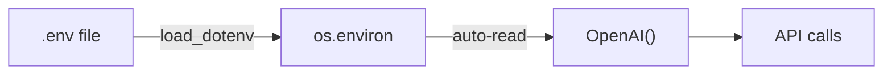
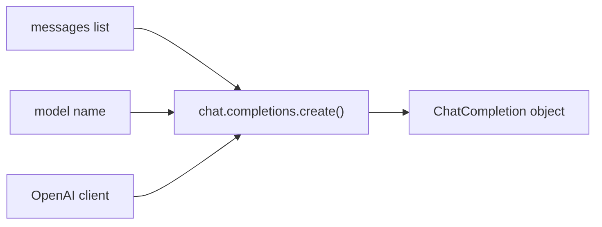
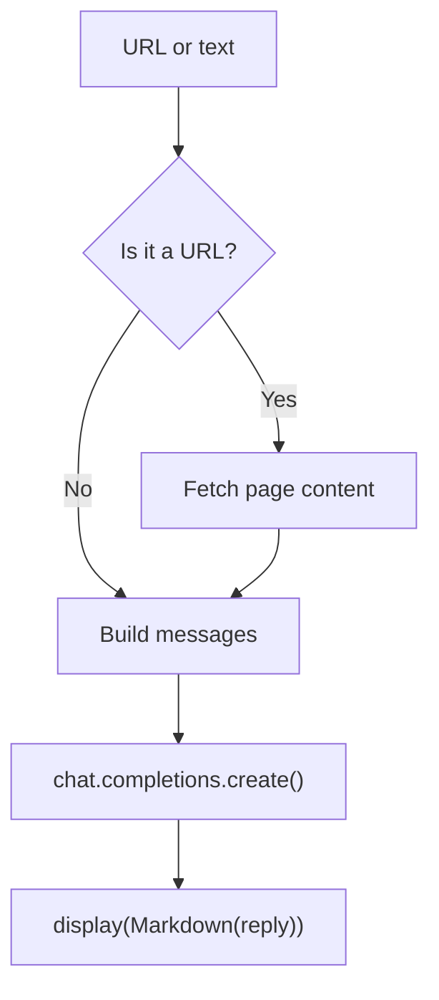
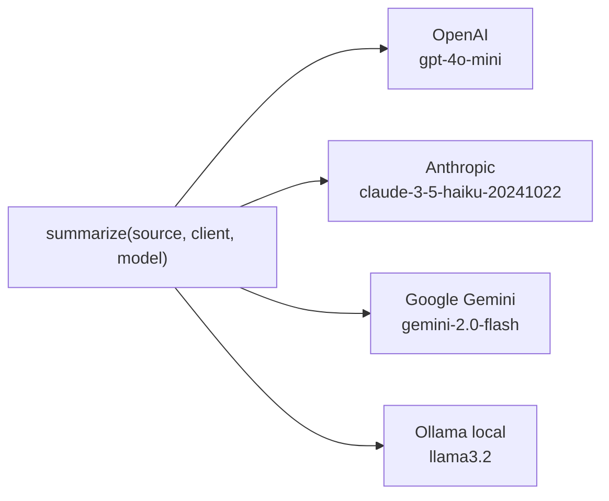

# Chat Completions API Basics

## Overview

The Chat Completions API is the core interface for sending instructions to a large language model and receiving a generated text response. It is the most commonly used API pattern for building LLM-powered applications. This guide covers the fundamental concepts and usage patterns for working with chat completions, including multi-provider compatibility and common limitations.

## Table of Contents

1. [API Key Setup](#api-key-setup)
2. [The Message Model](#the-message-model)
3. [Making a Request](#making-a-request)
4. [Reading the Response](#reading-the-response)
5. [Displaying as Markdown](#displaying-as-markdown)
6. [Putting It Together: A Summarizer](#putting-it-together-a-summarizer)
7. [Multi-Provider Compatibility](#multi-provider-compatibility)
8. [Limitations](#limitations)

---

## API Key Setup

API keys must never be hardcoded in source files. Load them from a `.env` file at runtime.

```bash
# .env
OPENAI_API_KEY=sk-...
ANTHROPIC_API_KEY=sk-ant-...
GOOGLE_API_KEY=...
# Ollama runs locally — no key needed
```

```python
from dotenv import load_dotenv
load_dotenv(override=True)   # reads .env into os.environ
```

The `OpenAI` client automatically picks up `OPENAI_API_KEY` from the environment.



---

## The Message Model

Every request is built from an ordered list of messages. Each message has two fields:

| Field | Values | Purpose |
| ------- | -------- | --------- |
| `role` | `system`, `user`, `assistant` | Who is speaking |
| `content` | string | What they said |

### Roles

- **`system`** — Sets the model's behavior and persona. Processed before any user input.
- **`user`** — The human's input: a question, instruction, or text to process.
- **`assistant`** — A previous model reply, used when reconstructing conversation history.

### Minimal Message List

```python
messages = [
    {"role": "system", "content": "You summarize content clearly and concisely."},
    {"role": "user",   "content": "Summarize this: ..."}
]
```

The model receives the entire list as a single prompt:

$$P(\text{response} \mid \text{system}, \text{user})$$

---

## Making a Request

`chat.completions.create()` sends the message list to the model.

```python
from openai import OpenAI

client = OpenAI()

response = client.chat.completions.create(
    model="gpt-4o-mini",
    messages=messages
)
```

### Request Flow



---

## Reading the Response

The `ChatCompletion` object contains the generated text and usage statistics.

```bash
ChatCompletion
├── choices[0]
│   ├── finish_reason   "stop" | "length" | "tool_calls"
│   └── message
│       ├── role        "assistant"
│       └── content     ← the generated text
└── usage
    ├── prompt_tokens
    ├── completion_tokens
    └── total_tokens
```

```python
reply = response.choices[0].message.content
tokens_used = response.usage.total_tokens
```

### Finish Reasons

| Value | Meaning |
| ------- | --------- |
| `stop` | Model finished naturally |
| `length` | Hit token limit — response may be cut off |
| `tool_calls` | Model wants to execute a function |

---

## Displaying as Markdown

LLMs naturally produce Markdown-formatted text. Use `IPython.display` to render it in a notebook.

```python
from IPython.display import Markdown, display

display(Markdown(reply))
```

---

## Putting It Together: A Summarizer

A function that accepts a URL or plain text, fetches content if needed, and returns a model-generated summary.



```python
import requests
from bs4 import BeautifulSoup

def summarize(source: str, client, model: str) -> str:
    """Accept a URL or plain text. Return an LLM-generated summary."""
    if source.startswith("http"):
        html = requests.get(source, timeout=10).text
        text = BeautifulSoup(html, "html.parser").get_text(separator="\n", strip=True)
    else:
        text = source

    messages = [
        {"role": "system", "content": "Summarize the following content clearly and concisely."},
        {"role": "user",   "content": text[:4000]}
    ]

    response = client.chat.completions.create(model=model, messages=messages)
    return response.choices[0].message.content
```

---

## Multi-Provider Compatibility

The `OpenAI` Python client works with any provider that exposes an OpenAI-compatible endpoint. Only `base_url`, `api_key`, and `model` change — the call pattern is identical.



### Provider Configuration

```python
import os
from openai import OpenAI

PROVIDERS = {
    "openai": {
        "client": OpenAI(),
        "model":  "gpt-4o-mini",
    },
    "claude": {
        "client": OpenAI(
            base_url="https://api.anthropic.com/v1",
            api_key=os.getenv("ANTHROPIC_API_KEY"),
        ),
        "model": "claude-3-5-haiku-20241022",
    },
    "gemini": {
        "client": OpenAI(
            base_url="https://generativelanguage.googleapis.com/v1beta/openai",
            api_key=os.getenv("GOOGLE_API_KEY"),
        ),
        "model": "gemini-2.0-flash",
    },
    "ollama": {
        "client": OpenAI(
            base_url="http://localhost:11434/v1",
            api_key="ollama",          # required by client, not validated
        ),
        "model": "llama3.2",
    },
}
```

### Side-by-Side Comparison

```python
PROMPT = "What is a large language model? Answer in one sentence."

for name, cfg in PROVIDERS.items():
    reply = summarize(PROMPT, cfg["client"], cfg["model"])
    print(f"[{name}] {reply}\n")
```

### Provider Reference

| Provider | `base_url` | Key env var | Notes |
| ---------- | ----------- | ------------- | ------- |
| OpenAI | *(default)* | `OPENAI_API_KEY` | |
| Anthropic | `https://api.anthropic.com/v1` | `ANTHROPIC_API_KEY` | OpenAI-compatible endpoint |
| Google Gemini | `https://generativelanguage.googleapis.com/v1beta/openai` | `GOOGLE_API_KEY` | |
| Ollama | `http://localhost:11434/v1` | any string | Run `ollama pull <model>` first |

---

## Limitations

| Limitation | Impact |
| ----------- | -------- |
| Token budget | `text[:4000]` is a rough guard — measure tokens for precision |
| No memory | Each call is stateless; this function has no conversation history |
| Static content | `requests` + BeautifulSoup misses JavaScript-rendered pages |
| Provider drift | OpenAI-compatible endpoints differ slightly; some parameters may be ignored |
| Cost | Every call consumes tokens; long inputs cost more |
