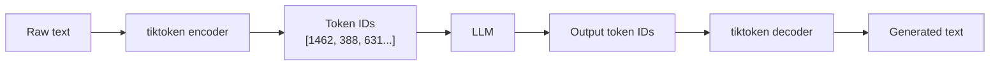
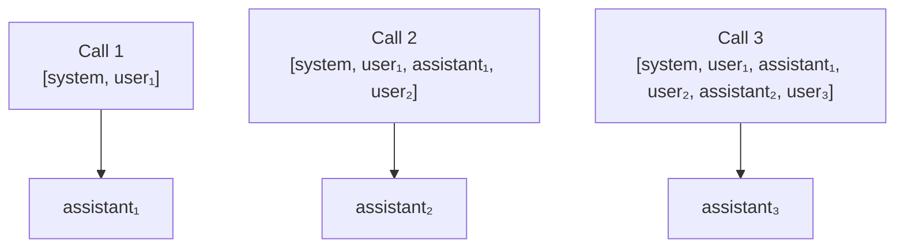

# Tokens and Conversation Memory

## Overview

LLMs process text as sequences of **tokens** — not characters, not words. A token is a chunk of text determined by the model's tokenizer, typically 3–4 characters long. Every model has a **context window**: a hard limit on how many tokens it can receive in a single call. Because LLMs are completely stateless, simulating memory means passing the full conversation history in the messages list on every request. Understanding tokens is the prerequisite for every context management technique that follows — RAG, summarization, agents, and fine-tuning all depend on it.

## Table of Contents

1. [What is a Token?](#what-is-a-token)
2. [Encoding and Decoding with tiktoken](#encoding-and-decoding-with-tiktoken)
3. [Counting Tokens](#counting-tokens)
4. [LLM Statelessness and Memory](#llm-statelessness-and-memory)
5. [Multi-Turn Conversation Pattern](#multi-turn-conversation-pattern)
6. [Context Window Limits](#context-window-limits)
7. [Limitations](#limitations)

---

## What is a Token?

A token is the atomic unit of text that a model reads and writes. The tokenizer splits any input string into a sequence of token IDs before it reaches the model. The model never sees raw characters — only token IDs.

```bash
"Transformers changed everything."
→ [1462, 388, 631, 4864, 13]
→ ["Transform", "ers", " changed", " everything", "."]
```

### Key properties

- One token ≈ 4 characters or ¾ of a word in English
- Whitespace, punctuation, and casing are part of the token
- Different models use different tokenizers — `tiktoken` is for OpenAI models
- Token IDs are model-specific; the same word may map to different IDs across models

### Why tokens matter

$$\text{cost} = (\text{prompt\_tokens} \times p_{\text{in}}) + (\text{completion\_tokens} \times p_{\text{out}})$$

Both cost and the context window limit are measured in tokens, not characters.

---

## Encoding and Decoding with tiktoken

`tiktoken` is OpenAI's tokenizer library. It encodes strings to token ID lists and decodes them back.

```python
import tiktoken

enc = tiktoken.encoding_for_model("gpt-4o-mini")

# Encode: string → token IDs
ids = enc.encode("Transformers changed everything.")
print(ids)               # [1462, 388, 631, 4864, 13]

# Decode: token IDs → string
text = enc.decode(ids)
print(text)              # "Transformers changed everything."

# Inspect individual tokens
for id in ids:
    print(id, repr(enc.decode([id])))
# 1462  'Transform'
# 388   'ers'
# 631   ' changed'
# 4864  ' everything'
# 13    '.'
```

### Encoding flow



---

## Counting Tokens

Count tokens in a messages list before sending a request to track cost and avoid hitting context limits.

```python
def count_tokens(messages: list[dict], enc) -> int:
    """Approximate token count for a messages list."""
    return sum(len(enc.encode(m["content"])) for m in messages)
```

> **Note:** This is an approximation. OpenAI adds a small overhead per message for role formatting. The exact formula is in the [OpenAI cookbook](https://github.com/openai/openai-cookbook/blob/main/examples/How_to_count_tokens_with_tiktoken.ipynb), but `sum of content tokens` is sufficient for intuition.

---

## LLM Statelessness and Memory

Every call to `chat.completions.create()` is independent. The model has no memory of previous calls — it only sees what you send in the current `messages` list.



The "memory" is entirely managed by you — by appending each turn to the list before the next call.

---

## Multi-Turn Conversation Pattern

```python
def chat(history: list[dict], user_input: str, client, model: str, enc) -> tuple[str, list[dict]]:
    """
    Append user turn, call API, append assistant reply.
    Prints token count before each call for visibility.
    Returns reply and updated history.
    """
    history.append({"role": "user", "content": user_input})
    print(f"[tokens before call: {count_tokens(history, enc)}]")

    response = client.chat.completions.create(model=model, messages=history)
    reply = response.choices[0].message.content

    history.append({"role": "assistant", "content": reply})
    return reply, history
```

### What grows each turn

| Turn | Messages list |
| ------ | -------------- |
| 1 | `[system, user₁]` |
| 2 | `[system, user₁, assistant₁, user₂]` |
| 3 | `[system, user₁, assistant₁, user₂, assistant₂, user₃]` |
| n | 2n + 1 messages |

Each call sends the entire history. Token count grows monotonically.

---

## Context Window Limits

When the messages list exceeds the model's context window, the API raises an error.

| Model | Context window |
| ------- | --------------- |
| gpt-4o-mini | 128,000 tokens |
| gpt-4o | 128,000 tokens |
| claude-3-5-sonnet | 200,000 tokens |
| gemini-1.5-pro | 1,000,000 tokens |

### Detecting proximity to the limit

```python
CONTEXT_LIMIT = 128_000  # for gpt-4o-mini
WARNING_THRESHOLD = 0.85  # warn at 85% usage

def check_context(history: list[dict], enc) -> None:
    used = count_tokens(history, enc)
    pct = used / CONTEXT_LIMIT * 100
    print(f"Context used: {used:,} / {CONTEXT_LIMIT:,} tokens ({pct:.1f}%)")
    if used > CONTEXT_LIMIT * WARNING_THRESHOLD:
        print("WARNING: approaching context limit — consider truncating history")
```

### Strategies when the limit is near

| Strategy | Trade-off |
| ---------- | ----------- |
| Truncate oldest turns | Loses early context |
| Summarize history | Approximation; loses detail |
| Sliding window | Keeps recent N turns only |
| RAG | Retrieves relevant context on demand |

---

## Limitations

| Limitation | Impact |
| ----------- | -------- |
| Approximate token count | `sum(encode(content))` ignores per-message overhead — use for intuition, not billing |
| tiktoken is OpenAI-only | Other providers use different tokenizers; token counts will differ |
| Growing history cost | Every turn adds tokens to the prompt — long conversations become expensive |
| No automatic truncation | The API will error if you exceed the context limit; you must manage it |
| Statelessness is a feature | Passing history gives you full control, but it is your responsibility to manage it |
