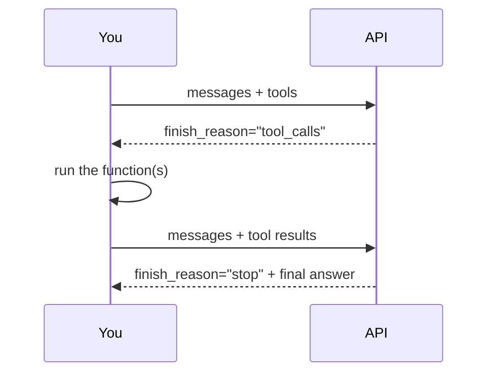

# Tool Calling with Function Dispatch

## Overview

Tool calling lets an LLM decide when to invoke your code, execute it, and resume the conversation with the result. The model never runs functions itself — it produces a structured signal when it wants a tool, you run the function, and you feed the result back as a `role: "tool"` message. The loop continues until `finish_reason == "stop"`. This pattern is the foundation of every agentic system built on chat APIs.

## Table of Contents

1. [How Tool Calling Works](#how-tool-calling-works)
2. [Defining Tools as JSON Schema](#defining-tools-as-json-schema)
3. [The Tool-Calling Loop](#the-tool-calling-loop)
4. [Function Dispatch](#function-dispatch)
5. [SQLite as a Data Source](#sqlite-as-a-data-source)
6. [When the Model Skips a Tool](#when-the-model-skips-a-tool)
7. [Multiple Tool Calls in One Turn](#multiple-tool-calls-in-one-turn)
8. [Limitations](#limitations)

---

## How Tool Calling Works

Tool calling is not a special API mode. It is a structured use of the existing `finish_reason` field.

```bash
Normal response:
  finish_reason: "stop"    → choices[0].message.content has the answer

Tool call response:
  finish_reason: "tool_calls" → choices[0].message.tool_calls has the requests

```

The model expresses intent. You execute the code. The conversation continues.



---

## Defining Tools as JSON Schema

Every tool is a dict passed in the `tools` parameter. The `description` tells the model *when* to use it. The `parameters` schema tells it *what to pass*.

```python
tools = [
    {
        "type": "function",
        "function": {
            "name": "get_ticket_price",
            "description": "Look up the price of a return airline ticket to a destination city.",
            "parameters": {
                "type": "object",
                "properties": {
                    "city": {
                        "type": "string",
                        "description": "The destination city (e.g. 'London', 'Tokyo').",
                    }
                },
                "required": ["city"],
                "additionalProperties": False,
            },
        },
    }
]
```

### Tool schema structure

```bash
tool
├── type             "function"
└── function
    ├── name         must match the Python function name used in dispatch
    ├── description  plain English — what it does and when to use it
    └── parameters   JSON Schema describing the arguments
        ├── type     "object"
        ├── properties
        │   └── <arg_name>
        │       ├── type        "string" | "number" | "boolean" | ...
        │       └── description tells the model what to fill in
        ├── required    list of required argument names
        └── additionalProperties  False (recommended)
```

The description field is the most important — it determines whether the model calls the tool at all.

---

## The Tool-Calling Loop

A single `if` check handles one round of tool calls. A `while` loop handles chained calls — where the model calls one tool, gets a result, then calls another.

```python
response = client.chat.completions.create(
    model=MODEL, messages=messages, tools=tools
)

while response.choices[0].finish_reason == "tool_calls":
    assistant_msg = response.choices[0].message
    tool_results = [dispatch_tool(tc) for tc in assistant_msg.tool_calls]

    messages.append(assistant_msg)    # assistant turn with tool_calls
    messages.extend(tool_results)     # one role:"tool" per call

    response = client.chat.completions.create(
        model=MODEL, messages=messages, tools=tools
    )

final_answer = response.choices[0].message.content
```

### Message list after one tool round

```bash
messages
├── {"role": "system",    "content": "..."}
├── {"role": "user",      "content": "How much is a flight to Tokyo?"}
├── {"role": "assistant", "tool_calls": [{...}]}   ← model's signal
└── {"role": "tool",      "tool_call_id": "...",   ← your result
                          "content": "A return ticket to Tokyo costs $1420."}
```

The model reads the tool result in the next call and produces its final answer.

---

## Function Dispatch

A registry maps tool names to Python callables. `dispatch_tool` parses the model's JSON arguments and routes to the right function.

```python
TOOL_REGISTRY = {
    "get_ticket_price": get_ticket_price,
    "set_ticket_price": set_ticket_price,
}


def dispatch_tool(tool_call) -> dict:
    name = tool_call.function.name
    args = json.loads(tool_call.function.arguments)  # always valid JSON

    fn = TOOL_REGISTRY.get(name)
    result = fn(**args) if fn else f"Unknown tool: {name}"

    return {
        "role": "tool",
        "tool_call_id": tool_call.id,   # must match the call
        "content": result,
    }
```

The `tool_call_id` links the result back to the specific call. If you have multiple tool calls in one turn, each result needs its matching ID.

---

## SQLite as a Data Source

Tools are most useful when backed by real data. SQLite is a zero-setup persistent store for local development.

```python
import sqlite3

DB = "prices.db"

def get_ticket_price(city: str) -> str:
    with sqlite3.connect(DB) as conn:
        cursor = conn.cursor()
        cursor.execute("SELECT price FROM prices WHERE city = ?", (city.lower(),))
        row = cursor.fetchone()
    if row:
        return f"A return ticket to {city.title()} costs ${row[0]:.0f}."
    return f"No price data available for '{city}'."


def set_ticket_price(city: str, price: float) -> str:
    with sqlite3.connect(DB) as conn:
        cursor = conn.cursor()
        cursor.execute(
            "INSERT INTO prices (city, price) VALUES (?, ?)"
            " ON CONFLICT(city) DO UPDATE SET price = ?",
            (city.lower(), price, price),
        )
        conn.commit()
    return f"Price for {city.title()} updated to ${price:.0f}."
```

Parameterised queries (`?` placeholders) prevent SQL injection. Never interpolate user-supplied strings directly into SQL.

---

## When the Model Skips a Tool

The model only calls a tool when the user's request requires it. For questions it can answer from training data or the system prompt, `finish_reason` is `"stop"` and `tool_calls` is `None`.

```python
# Tool fires:
"How much is a flight to Tokyo?"
→ finish_reason: "tool_calls"
→ TOOL CALLED: get_ticket_price('tokyo')

# No tool:
"What time does customer service open?"
→ finish_reason: "stop"
→ "I'm sorry, I don't have information about customer service hours..."
```

You can observe this by printing `finish_reason` before the loop.

---

## Multiple Tool Calls in One Turn

The model can request several tools in a single response — for example, when comparing prices across cities. `message.tool_calls` is a list; process every item.

```python
# "What's the price difference between Paris and Berlin?"
# → tool_calls: [get_ticket_price("paris"), get_ticket_price("berlin")]

tool_results = [dispatch_tool(tc) for tc in assistant_msg.tool_calls]
messages.extend(tool_results)
```

Each result is a separate `role: "tool"` message with its own `tool_call_id`. The model receives all results before producing the final answer.

---

## Limitations

| Limitation | Impact |
| ----------- | -------- |
| No auth on write tools | Any user can call `set_ticket_price` — add permission checks in production |
| Model-generated arguments | Arguments may be semantically wrong; validate before hitting the DB |
| Single-file SQLite | Fine for demos; use a proper DB (Postgres, etc.) in production |
| No streaming during tool loop | The UI blocks until the full while-loop completes |
| Silent tool errors | Unhandled exceptions in dispatch break the conversation — wrap in try/except |
| Tool descriptions drive behaviour | A vague description causes missed or incorrect tool calls |
